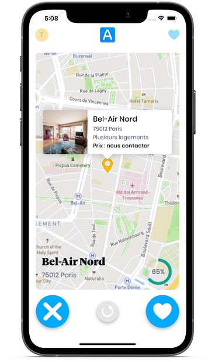
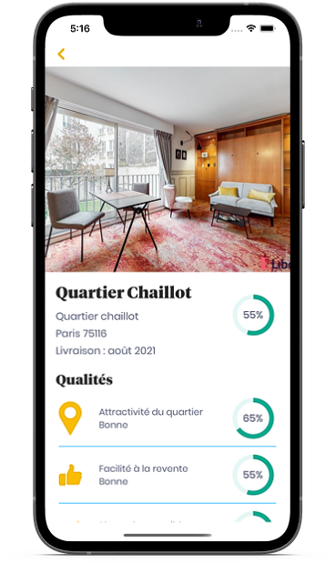
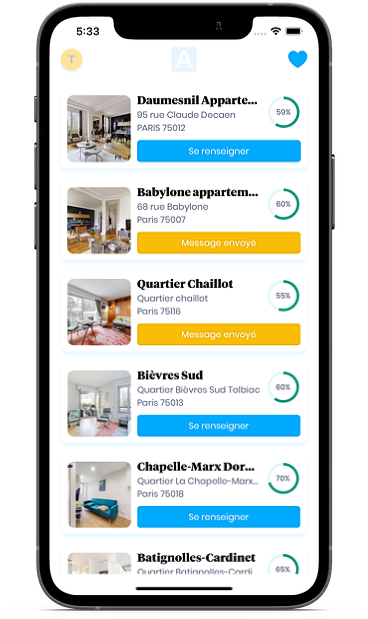
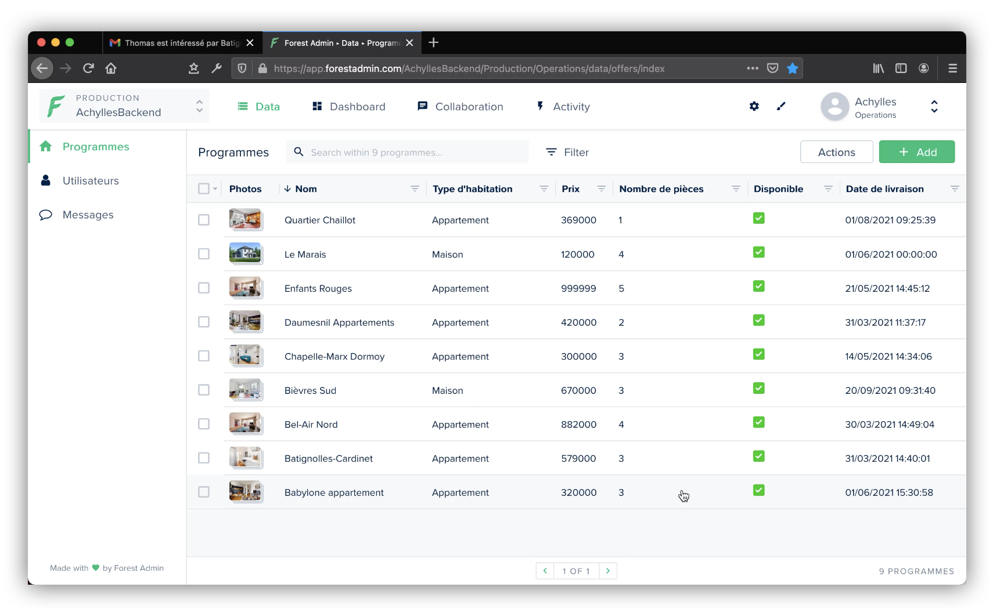
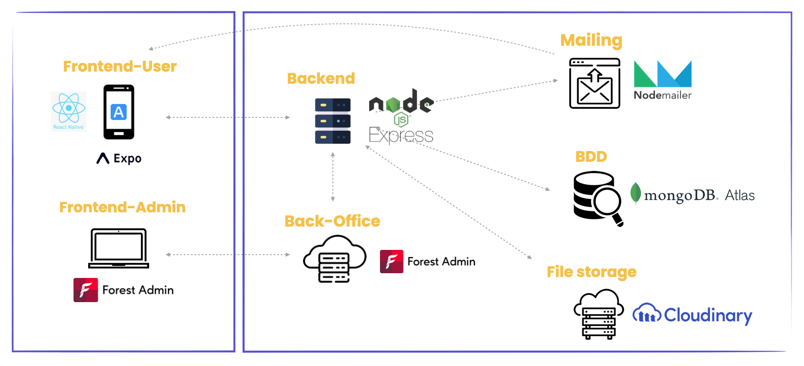

# Achylles Mobile App

## Overview

MVP of a mobile application for French real estate company Achylles. With a multi-step search form and a tinder-like results display this app's ambition is to offer an innovative way to look for your next new-build investment.

**DISCLAIMER**: this repository is only a preview of the app, the source code is the property of the client and has been made private.

## Screenshots

**User App**

 
 

**Admin Backoffice**

## Main Features

-  Login and signup with account verification by email
-  Multi-step search form (budget, location...)
-  Geolocated results in a Tinder like format with the possibility to swipe on the featured programs
-  Saving of liked programs and possibility to contact Achylles via the app
-  Emailing system notifying the user or Achylles at each important step
-  Program and user management (CRUD) from a web-based Back-Office
-  Push-notifications informing the user when new programs are added
-  Settings page to update user information

## Stack & Dependencies

Mobile app built with [React Native](https://reactnative.dev/) and [Expo](https://expo.io/).

### Project architecture

### Main dependencies

#### Frontend

-  [react-native-swiper](https://github.com/leecade/react-native-swiper)
-  [mapbox](https://www.mapbox.com/)
-  [expo notifications](https://docs.expo.io/push-notifications/overview/)
-  [mapview](https://github.com/react-native-maps/react-native-maps)
-  [react-native-swiper-flatlist](https://www.npmjs.com/package/react-native-swiper-flatlist)

#### Backend

-  cloudinary
-  express
-  forest admin
-  mongoose
-  nodemailer

## Contributors

-  **Cathy Sengmany** - [GitHub Profile](https://github.com/csengmany)
-  **Samy Safsaf** - [GitHub Profile](https://github.com/SamySafsaf)
-  **Thomas Bonte** - [GitHub Profile](https://github.com/Thmsbonte)
-  **Teddy Beau** - [GitHub Profile](https://github.com/teddy-beau)
